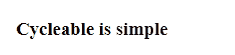

# Cycleable

Simple inline text cycling with configuration via markup

## Usage

The global function `_Cycleable_` will be exposed and can be invoked to attach to all `.cycleable` classes in the DOM.

```html
<link rel="stylesheet" href="/path/to/cycleable.css">

<h3>
    Cycleable is
    <span
        class="cycleable"
        js-items="simple,lightweight,configurable"
        js-timeout="1000"
        js-delay="1000"
    ></span>
</h3>


<script src="/path/to/cycleable.js"></script>
<script>
    _Cycleable_();
</script>
```



## Options (all optional)

| property    | type   | description                                               | default    |
|-------------|--------|-----------------------------------------------------------|------------|
| attachTo    | string | Selector used in `document.querySelectorAll()`            | .cycleable |
| itemsAttr   | string | Override the markup attribute for list of items           | js-items   |
| timeoutAttr | string | Override the markup attribute for timeout                 | js-timeout |
| delayAttr   | string | Override the markup attribute for delay                   | js-delay   |
| inClass     | string | Override the classname for when the next element enters   | in         |
| outClass    | string | Override the classname for when the current element exits | out        |

## Usage (cont.)

```html
<link rel="stylesheet" href="/path/to/cycleable.css">

<h3>
    I like
    <span
        class="cycleable"
        my-list="Turtles,Web Dev,Turtles"
        my-timeout="1000"
        my-delay="1000"
    ></span>
    !
</h3>


<script src="/path/to/cycleable.js"></script>
<script>
    _Cycleable_({
        itemsAttr: 'my-list',
        timeoutAttr: 'my-timeout',
        delayAttr: 'my-delay',
    });
</script>
```
